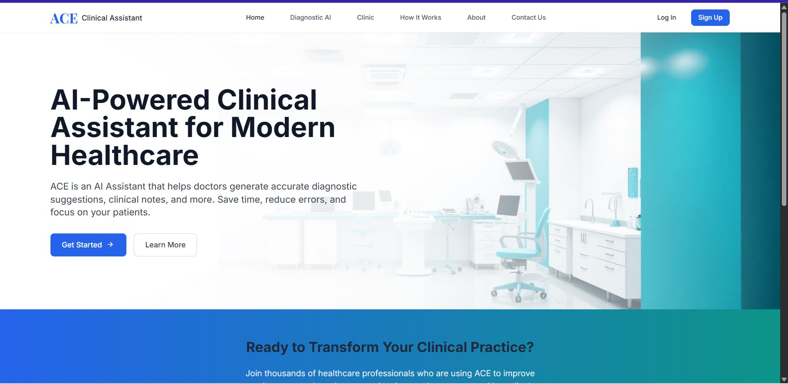
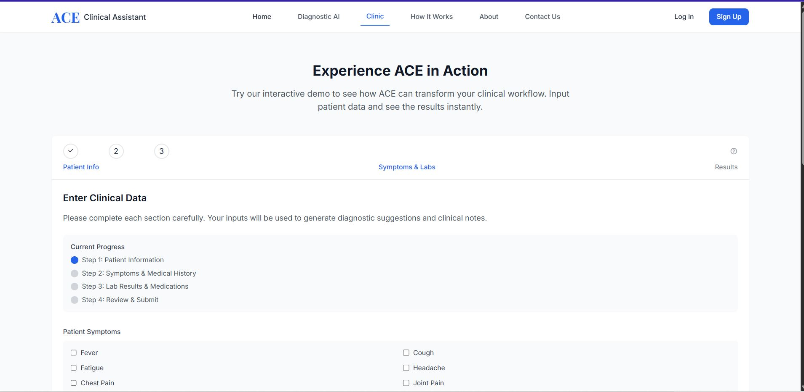
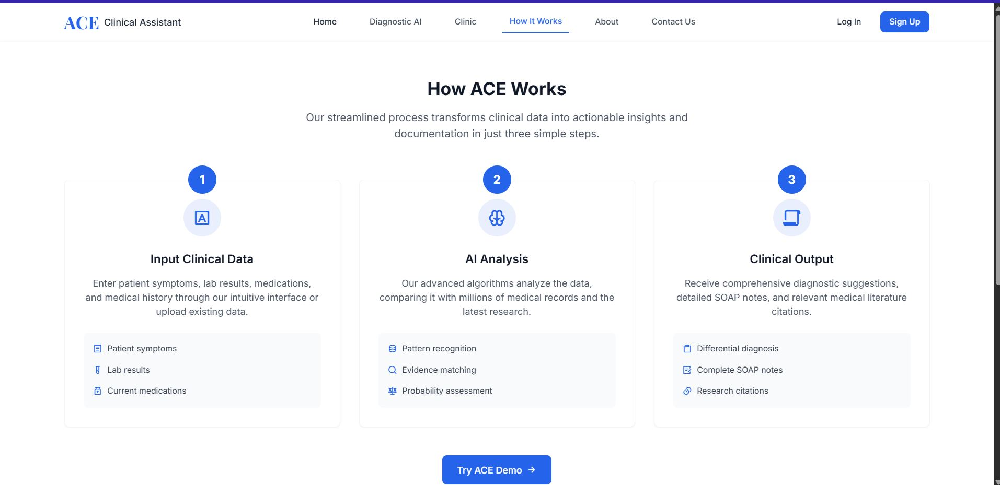

# 🧠 Ace Medical Diagnostic System

#Medical Diagnosis Web App using Machine Learning

**An AI-powered clinical assistant for early disease detection and diagnostic support.**  
**A machine learning-powered web application for early health disease detection using allopathic medical data. Users can upload their medical records, get predictions, book doctor appointments, and communicate via email—all in one platform.*
Built to empower doctors and patients with fast, reliable insights, automated documentation, and a seamless medical workflow.

---

## 🚀 Overview

The **Ace Medical Diagnostic System** is a web-based application that leverages machine learning to support early diagnosis and intelligent clinical decision-making. It allows users to:

- Upload clinical data
- Receive AI-generated diagnostic suggestions
- Generate structured SOAP notes
- Book doctor consultations
- Send secure emails
- And more — all within a unified medical assistant platform.

---

## 🌟 Features

- 🧠 **Diagnostic AI Chat** — Describe symptoms and receive diagnostic insights instantly.
- 🧾 **Automated SOAP Notes** — Structured clinical notes generated based on AI analysis.
- 🧬 **Interactive Lab & Symptom Input** — Enter clinical data like WBC, CRP, symptoms, and history.
- 📑 **EHR-Compatible Formats** — Outputs compatible with medical record systems.
- 🔗 **PubMed-Linked Citations** — Evidence-backed suggestions with direct links to medical research.
- 🎙️ **Voice & File Upload Support** — Upload lab reports or use voice for symptom input.
- 📅 **Doctor Booking Module** — Schedule consultations via integrated calendar system.
- 📧 **Email Notification System** — Securely sends reports and updates to users.
- 📲 **Responsive Design** — Works seamlessly across devices.

---

## 🛠 Tech Stack

- **Frontend**: HTML5, Tailwind CSS, JavaScript (Vanilla)
- **Backend**: Flask (Python)
- **ML Models**: Scikit-learn, XGBoost (for predictions)
- **APIs**: PubMed Integration (for medical research), Email SMTP
- **Templating**: Jinja2
- **Data Formats**: CSV, JSON, HL7 FHIR-compatible (optional)

---


## 🖼 Screenshots

### 🔍 Diagnostic Interface
[](static/images/diagnose1.JPG)

### 📝 Clinical Workflow Forms
[](static/images/diagnose2.JPG)

### 📊 How it works
[](static/images/diagnose3.JPG)

---

## 📦 Installation

1. **Clone the Repository**
   ```bash
   git clone https://github.com/your-username/ace-medical-diagnostic-system.git
   cd ace-medical-diagnostic-system

2. **pip install -r requirements.txt**

3. **Run python app.py**

⚙️ Usage Guide
On first load, the homepage shows an overview of ACE.

Navigate using the navbar to access:

Diagnostic AI (/chat)

Clinic Demo (/clinic)

How It Works (/how)

About (/about)

Upload files or enter data for diagnosis

Use the voice mic or type in symptoms

View automated notes and PubMed links

🤝 Contributing
We welcome community contributions! To contribute:

Fork the repo

Create a new branch (git checkout -b feature-name)

Commit your changes (git commit -m "Added new feature")

Push to your fork (git push origin feature-name)

Open a Pull Request

🛡 License
This project is licensed under the MIT License — feel free to use and adapt.

👨‍💻 Developer
Aliyu Hakeem Tosin
📧 Email: tosinhakeem4@gmail.com
🔗 LinkedIn [(www.linkedin.com/in/acetosyn)](https://linkedin.com/in/acetosyn)
🌍 Location: Abuja, Nigeria


